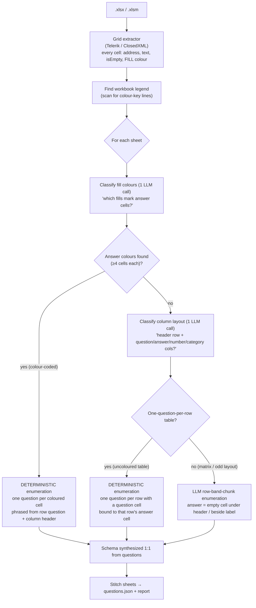

# How Excel questionnaire extraction works

This explains how RfpExtractor turns an Excel questionnaire (`.xlsx` / `.xlsm`) into the answerable
question list — in particular how it handles the two shapes that defeat a naïve "one question per empty
cell" approach: **colour-coded DDQ templates** (answers marked by cell fill) and **plain one-question-
per-row tables** (`No. | Category | Question | Answer`), both the norm in enterprise procurement.

## TL;DR — the core idea

> **Let the LLM do judgement, let code do enumeration.**

Finding *which cells are answers* on a professional template is a judgement call (colour legends,
auto-calculated cells, assessor-only areas) — the LLM is good at that. Emitting *one question for each
of several hundred near-identical answer cells* is bookkeeping — the LLM is bad at that (it samples a
few and stops), but code does it perfectly. So the pipeline splits the work along that line.

## Why Excel is harder than Word/PDF

A Word questionnaire is read linearly — each printed prompt is a question. An Excel questionnaire is a
2-D grid where the *answers* are blank (or drop-down) cells, and the interesting signal is **where the
respondent is meant to type**. Two things make that hard:

1. **Emptiness is a weak signal.** A real form has thousands of empty cells — spacers, layout gaps,
   an assessor scoring area — and only a fraction are real answer cells. On the colour-coded DDQ: **2,847
   empty cells, but only ~255 are answers.**
2. **Professional templates encode answers by cell _colour_, not emptiness.** A legend says
   *"Green = fill manually, Yellow = pick from drop-down, Gray = auto-generated, Orange = assessor."*
   Many answer cells are **pre-filled** (a formula-driven default), so they aren't even empty.

Ignoring colour, an LLM handed the raw grid grabbed the wrong columns (the assessor scoring area) and
produced garbage. The fix is to read colour and make it the primary signal.

## The pipeline

Every sheet independently takes **one of three paths**, tried in order of reliability: colour-coded →
uncoloured table → plain grid. The first two enumerate in **code** (complete, deterministic); only a
sheet that is neither falls to the LLM.

### Path A — colour-coded sheet (deterministic)

Used when the colour classifier finds answer colours. This is the reliable, complete path.

1. **Classify colours (LLM, small + reliable).** `ILlmExtractor.DetectAnswerColoursAsync` is given a
   per-sheet profile — a fill histogram (`{fill, count, empty}`), a few sample values and sample row
   questions per colour, plus any legend lines found in the workbook — and returns just the fills that
   mark respondent answers, with an answer type each. It excludes auto-generated colours (cells almost
   all non-empty computed values), header/banner colours, and assessor-only areas. Output is tiny
   (2–4 colours), so it never truncates. See `Prompts.GridColours`.
   - A **count floor** (≥ 4 cells) then drops any colour that's really just a legend swatch.
2. **Enumerate in code (deterministic).** `ColourGridBuilder.Enumerate` walks the sheet and emits
   **one question per cell whose fill is an answer colour** — empty or pre-filled. Each question's text
   is built from:
   - the **row's question** = the longest non-answer text cell in that row; and
   - the **column header** = the nearest non-answer cell above in that column (a short first-line form
     goes into the question to tell sibling answer columns apart; the full header goes into
     `schema_ref.column`).
   - `binding` points back to the exact cell (`{kind:cell, sheet, address}`) for write-back.

Because code does the enumeration, the count is **guaranteed and identical every run**.

### Path B — uncoloured one-question-per-row table (deterministic)

Used when a sheet carries no answer colour but *is* a questionnaire table — the most common Excel DDQ
shape (`No. | Category | Question | Answer`). Same principle as Path A, applied to rows instead of
colours, because a single-shot LLM stops early here too (a bilingual Japanese/English DDQ: **10 of 17** rows,
dropping the last three sections; forcing chunks only added per-chunk inconsistency).

1. **Classify the column layout (LLM, small + reliable).** `ILlmExtractor.DetectTableColumnsAsync` is
   given the sheet's first few non-empty rows (`{row, cells:[{col, text}]}`) and returns whether it's a
   one-question-per-row table and, if so, the **header row** plus the **question / answer / number /
   category** column letters — choosing the questionnaire's own question column over any *translation*
   column. See `Prompts.TableColumns`. Not a table (a matrix, cover sheet, odd layout) → returns
   nothing and the sheet falls through to Path C.
2. **Enumerate in code (deterministic).** `TableGridBuilder.Enumerate` emits **one question per row
   whose question-column cell is non-empty** — so blank numbered *template* rows (a `No.` with no
   question) are skipped. Each question's text is the question cell verbatim (a non-English sheet stays
   in its own language for a later translation pass), its section is the row's category cell, and its
   `binding` points at that row's **answer cell** for write-back — one consistent column, every row.

Because code does the enumeration, the count is **guaranteed and identical every run**.

### Path C — plain / irregular grid (LLM)

Used when a sheet is neither colour-coded nor a clean question-per-row table (an AUM matrix, a headcount
projection with years across the top, an odd bespoke layout).

- The sheet is split into **row-band chunks** (`GridChunkCells`, default 600) so no single response can
  overflow the model's output budget, then the LLM enumerates answer cells from each chunk. With no
  fills, the grid prompt's fallback applies: *answer cells are the empty cells under a column header /
  beside a row label*. Each chunk carries the sheet's header rows for context, and answer candidates
  come only from a chunk's own band so no cell is covered twice.

This handles irregular grids where neither deterministic signal applies. Its limit is the LLM's — a very
large uncoloured grid could be under-enumerated — but the colour and table paths cover the two shapes
where that used to bite.

- **Coverage guard.** Because only this path trusts the model to *list* the questions, it's the only one
  that can silently drop rows. After it runs, the pipeline compares the count to a deterministic lower
  bound (`CountAnswerableRows` — rows with a question-like label *and* an empty cell) and **warns** when
  the model covered under 60% of it (above an 8-row floor). It's a nudge, not a failure — the signal to
  open `--dump-grid` and look. The colour and table paths are complete by construction and skip it.

## Supporting mechanics (shared by both paths)

- **Fill capture.** `GridCell.Fill` (normalized `RRGGBB`) is read by both spreadsheet extractors —
  `TelerikSpreadsheetExtractor` (`PatternFill.PatternColor`) and `ClosedXmlSpreadsheetExtractor`
  (`Style.Fill.BackgroundColor`). White / no-fill → null.
- **Questions-only + synthesized schema.** The grid model returns **questions only**; the
  `document_schema` is rebuilt deterministically from them (`GridSchema.Rebuild`) — one `data_entry`
  table per sheet, one cell per question. This halves the model's output (it doesn't serialize a
  redundant schema) and makes the 1:1 `answer_target` invariant hold **by construction**, so a
  truncated response can never orphan a schema target.
- **Render is decoupled.** For `--strategy=text` (recommended for Excel) the grid leg is authoritative
  and nothing is rendered. Under `--strategy=both`, a vision cross-check renders the workbook to images;
  a render failure (e.g. an embedded logo Telerik can't rasterize) **degrades to grid-only with a
  warning** rather than crashing. Image decoding is wired via `Telerik.Documents.ImageUtils`.

## Worked example — the colour-coded DDQ

A colour-coded IS due-diligence questionnaire, 188 rows × 21 columns.

| Fill | Cells | Role (from legend + stats) | Extracted? |
|---|---:|---|---|
| `E2EFDA` green | 254 | manual answer (all empty) — columns J, K | ✅ answer |
| `FFFFCC` yellow | 128 | drop-down answer (pre-filled formula) — column I | ✅ answer |
| `EAEAEA` gray | 575 | auto-generated (computed values) | ⛔ excluded |
| `003781` blue | 41 | section headers | ⛔ excluded |

**Result: 382 / 382 answer cells** (254 + 128), the READ ME instructions tab correctly skipped, 0
warnings, real DDQ question text per cell (each row's 3 answer columns differentiated by an
`— Response` / `— Response Details` / `— Additional comment` suffix). The pure-LLM approach reached only
1 → 12 → 24 before deterministic enumeration closed the gap.

## Extending to a new template

- **Different colours / legend wording:** nothing to change — the classifier reads the histogram +
  legend at runtime, so any colour scheme works as long as answer cells are visually distinct.
- **A colour-coded sheet the classifier misreads:** inspect it free with
  `rfpx <file>.xlsx --adapters-only` — the grid diagnostic prints the fill histogram
  (`fills: #E2EFDA×254(empty 254), …`). If a decorative colour is being taken as an answer, raise the
  count floor or tighten `Prompts.GridColours`.
- **Uncoloured question-per-row tables:** no action — Path B detects the columns and enumerates them.
  If the classifier picks the wrong question column (e.g. a translation column), tighten
  `Prompts.TableColumns`; a sheet it declines falls through to Path C.
- **Plain / irregular grids:** no action — they use Path C automatically.

## Recommended usage

- Use **`--strategy=text`** for Excel (grid-only; the grid is authoritative and vision adds little).
- Start any new file with **`--adapters-only`** to see the sheet shape and fill histogram before
  spending tokens.
- When a sheet looks wrong (a coverage-guard warning, an unexpected count), run **`--dump-grid`** — it
  prints the fully resolved grid (merged cells flattened, fills marked) one row per line and writes
  `grid-dump.txt`. No LLM or credentials needed. It's the fastest way to see exactly what the pipeline
  sees, and it beats hand-parsing the workbook XML (whose column positions lie on merged cells).
